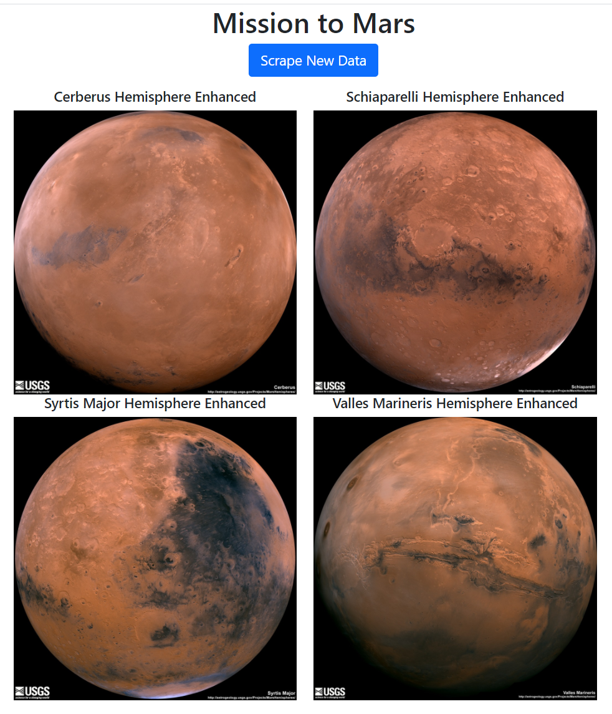
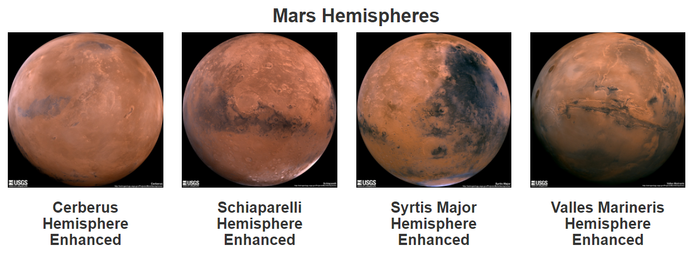

# Mission-to-Mars

### Objective

The objective of this project is to learn to integrate Python code with HTML using Flask and utilizing MongoDb. We extracted information and images from NASA website about the planet Mars using BeautifulSoup and Splinter and stored the information in MongoDb. The final product is a website in local web host (_http://127.0.0.1:5000/_) that contains the scraped information about the red planet with high resolution images and latest news about Mars.

### Analysis and Conclusions

We went to Nasa's website *https://redplanetscience.com/* with information about the planet Mars for news, *https://spaceimages-mars.com* for featured image and *https://marshemispheres.com/*.  We used the DevTools to _inspect_ the tags that could be used as the unique identifier of the components we seek. We used the following tools

- **Splinter** and **Beautiful Splinter** to automate the webscraping of the information we desire.
- **Mongo** to store the database.
- **Flask** to display the finished product in a webpage using HTML and CSS. 

#### Deliverable 1
We scraped four high resolution pictures of Mars from  https://marshemispheres.com/ using Splinter and BeautifulSoup to automate the extraction of the data. The code is in *Mission_to_Mars_Challenge.ipynb* file. We extracted the title and image-url of four high resolution figures. We saved all the information in a list as shown in Fig 1.  

**Fig 1.** The figure shows the list of the dictionary items scraped from https://marshemispheres.com/

#### Deliverable 2

We imported the Jupyter notebook code in the a python file, _scraping.py_ and the used _Flask_ to present the data in a web browser. The data stored in MongoDb, *mars_app* is extracted using the python file, *app.py* using _Flask_ routes. Initially I stacked the hemisphere images as shown in Fig 2. The HTML file was later modified to show the images as thumbnail for Deliverable 3 as shown in Fig 3 below. 

 

**Fig 2.** The figure shows four high resolution images of Mars Hemisphere imported by web scraping.

#### Deliverable 3

For this deliverable the webpage is made mobile-responsive. We added Bootstrap 3 components that divides a web page into a grid system. The image is shown in Fig 3. 

**Fig 3.** The figure shows four thumbnail images of Mars Hemispheres.